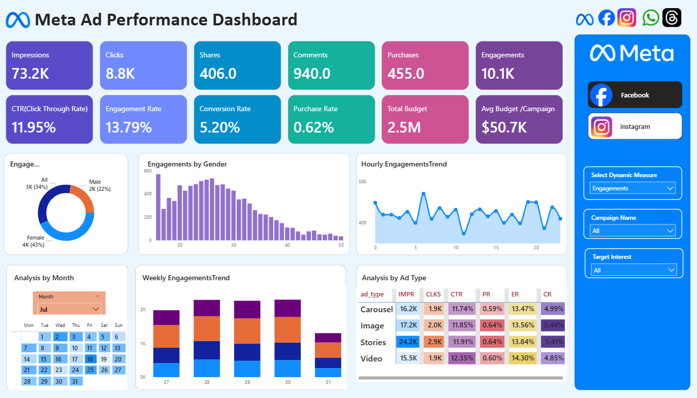
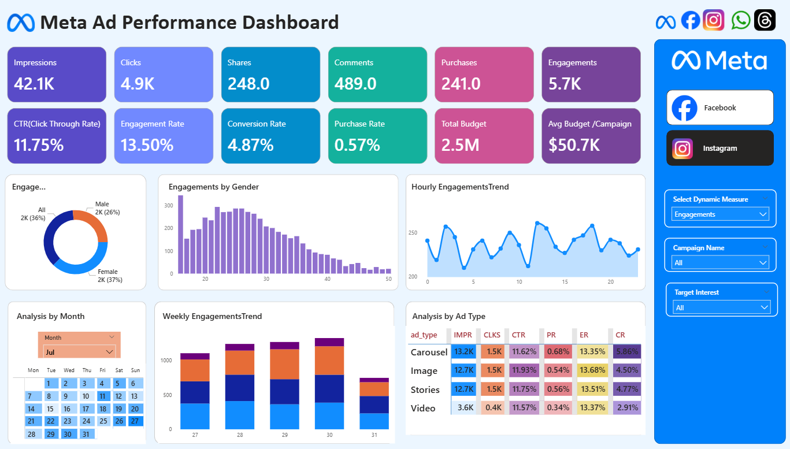
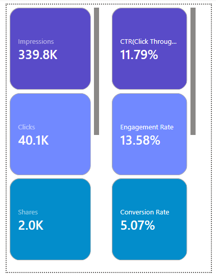

# Meta Ad Performance Dashboard

Meta ad performance analysis dashboards in Power BI.

---

## 📊 Project Overview

This Power BI project demonstrates analysis of Meta (Facebook & Instagram) Ads performance using dummy data for educational purposes.

The goal is to understand how ad metrics such as reach, engagement, and ROI can be analyzed to evaluate campaign effectiveness — without using any real company or client data.

---

## 🔍 Key Insights

- Analysis of campaign-wise performance and engagement trends  
- Metrics like Click-Through Rate (CTR), Cost per Click (CPC), and Return on Investment (ROI)  
- Identification of high-performing ads and budget optimization areas  
- Weekly/monthly trend visualization of ad outcomes  

---

## ⚙️ Tools & Techniques

- Power BI for dashboard design and data analysis  
- DAX for creating key performance indicators  
- Power Query for data transformation and cleaning  
- Excel/CSV as data source  

---

## 🎯 Objective

To practice real-world marketing analytics using Power BI and build an interactive dashboard that tracks ad efficiency metrics — completely for learning and demonstration purposes.

---

## 📌 04_Visuals – Dashboard Screenshots

### Facebook Ad Performance View

### Instagram Ad Performance View

### Calendar Tooltip Interaction View

---

## 🚀 Outcome

This project helps in understanding how digital marketing campaigns can be evaluated using data-driven insights and visualization techniques.

---

## 📎 Note

This project is created for learning purposes only and does not include any real client or proprietary data. purposes
